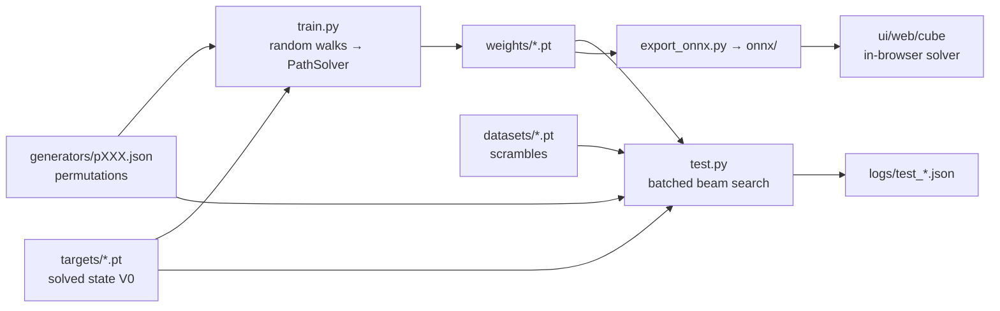

# Architecture

Pathsolver is a single-process PyTorch pipeline — there is no service split, no job
queue, no database. Everything is tensors on one device, with the filesystem as the
only interface between stages.

Each stage is documented separately:

- **[Pipeline]()** — the flow above, stage
  by stage, with the files each one reads and writes.
- **[The pathsolver package]()** — the ~1000
  lines that do the actual work: `model.py`, `trainer.py`, `searcher.py`, `dqn.py`,
  `utils.py`.
- **[Data contract]()** — the naming
  and shape conventions that let a new puzzle drop in without touching code.

## Design invariants

Two properties are worth stating up front, because most of the design follows from
them:

1. **Nothing is puzzle-aware.** The model sees a one-hot state vector; the search
   applies permutations. A puzzle is data, never code.
2. **Nothing loops in Python over states.** Every operation — neighbour expansion,
   hashing, deduplication, scoring, pruning — is a batched tensor op. This is what
   allows beams of \( 2^{20} \) states and is where the speedup comes from.

Anything you add should preserve both.
